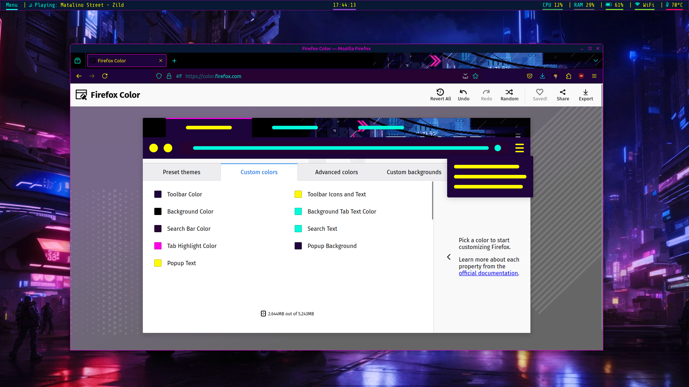
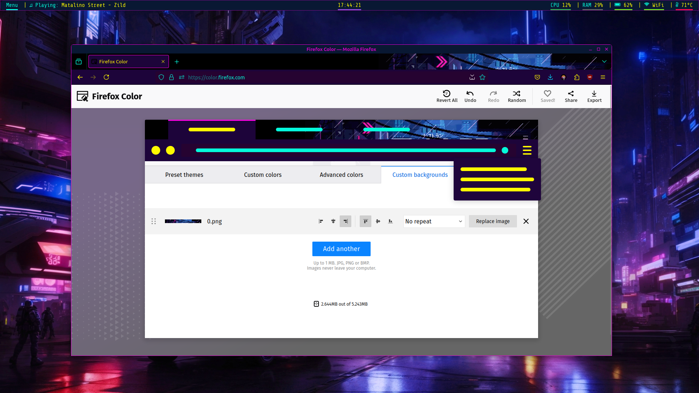

# Info
Since I cannot link the theme here due to licensing, I will instead just provide a tutorial on how to achieve the same theme as mine.

# Guide:
Savelink the [Black Rain Dark Mode](https://addons.mozilla.org/en-US/firefox/addon/black-rain-remasterd-dark-mode/?utm_source=addons.mozilla.org&utm_medium=referral&utm_content=search) which should download a **.xpi** file.
Unzip that **.xpi** file and keep the image located at **/images** for later use.

Search **firefox colors** which should prompt you to the [theme builder](https://color.firefox.com/), after that, customize the **custom colors** to these:
- Toolbar Color: 1D043A
- Toolbar Iconss and Text: FFF900
- Background Color: 000000
- Background Tab Text Color: 04FADB
- Search Bar Color: 260331
- Search Text: 04FADB
- Tab Highlight Color: FF00E6
- Popup Background: 1F053C
- Popup Text: FFFB00

After customizing the colors, head to **custom backgrounds** & upload the saved image at **/images** to have the background.
Align it to the right & to the top and change it to **no repeat**.

# Credits:
Credits to [@SimAr_](https://addons.mozilla.org/en-US/firefox/user/16736484/) for the [Black Rain](https://addons.mozilla.org/en-US/firefox/addon/black-rain-animated/?utm_source=addons.mozilla.org&utm_medium=referral&utm_content=search) theme.
Credits to [@Freezer](https://addons.mozilla.org/en-US/firefox/user/16906026/) for the [Black Rain Dark Mode](https://addons.mozilla.org/en-US/firefox/addon/black-rain-remasterd-dark-mode/?utm_source=addons.mozilla.org&utm_medium=referral&utm_content=search) theme.
Credits to [NoU](https://addons.mozilla.org/en-US/firefox/user/17151040/) for the [CyberPnk](https://addons.mozilla.org/en-US/firefox/addon/cyberpnk/?utm_source=addons.mozilla.org&utm_medium=referral&utm_content=search) colors.

# Screenshots:

