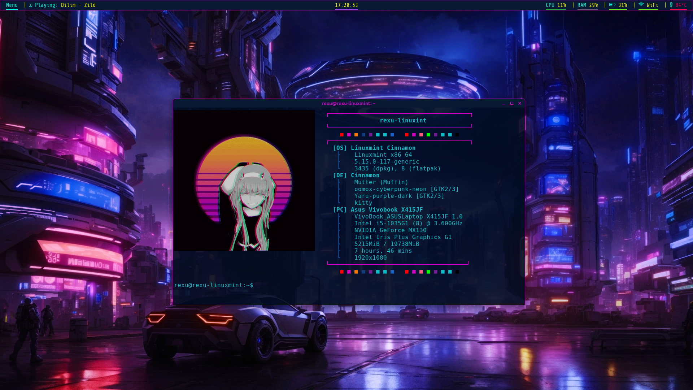

# Important:
- You must change the sectors to your liking since I just placed my own stuffs there instead of making it automatic.
- Add a **picture.png** to the folder if you want a picture to be displayed to your neofetch.

# Installation:
Clone this repository with this command. (This will copy the repository to your **/home** directory).
```bash
git clone https://www.github.com/RexxuDesu/Linux-Dotfiles Linux-Dotfiles
```

Then navigate to the cloned repository:
```bash
cd ~/Linux-Dotfiles
```
Then copy & paste the folder:
```bash
cp -r neofetch ~/.config/neofetch
```
OR move it:
```bash
mv -r neofetch ~/.config/neofetch
```

OR you may follow this if you don't want the nerd crap:

Download the files or **git clone** it. Find the folder then navigate to the **neofetch** folder, copy the folder then paste it on **~/.config**.

# Screenshots:

