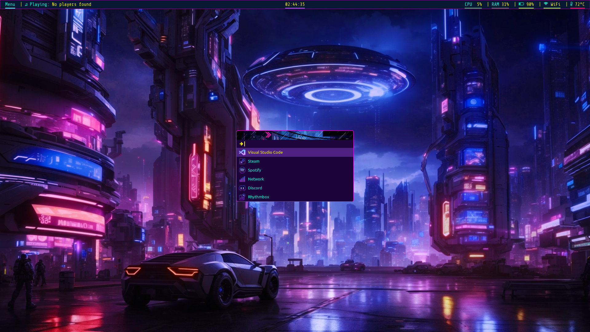

#Important
- This dotfile requires **Font Awesome** to render the icons properly.
- It is advised to bind this to a shortcut like **Super L** or whatever your preferred bind is.

# Installation:
Clone this repository with this command. (This will copy the repository to your **/home** directory).
```bash
git clone https://www.github.com/RexxuDesu/Linux-Dotfiles Linux-Dotfiles
```

Then navigate to the cloned repository:
```bash
cd ~/Linux-Dotfiles
```
Then copy & paste the folder:
```bash
cp -r polybar ~/.config/rofi
```
 OR move it:
```bash
mv -r polybar ~/.config/rofi
```

OR you may follow this if you don't want the nerd crap:

Download the files or **git clone** it. Find the folder then navigate to the **rofi** folder, copy the folder then paste it on **~/.config**.

# Screenshots:

